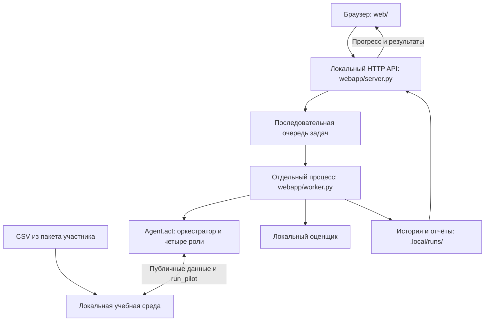

# Campaign Studio — Кейс Beeline

**Решение участника хакатона HackAlem AI.** Beeline — официальный партнёр хакатона и заказчик кейса. По прямому запросу пользователя размещён официальный логотип с сайта Beeline Казахстан; название Campaign Studio и обозначение участника сохранены. Источник оригинального файла и сведения о проверке бренд-материалов — в [аудите требований, §8](docs/requirements-audit.md#8-оформление-кейса-и-обозначение-участника).

Локальное приложение для кейса **HackAlem AI / Beeline**: исследует аудиторию, проверяет гипотезы на пилотах и формирует план тарифных предложений в пределах бюджета и лимита контактов. Веб-интерфейс позволяет запустить полный цикл, изучить решения агента и скачать результаты.

**Статус:** рабочая локальная версия с Python-агентом, интерфейсом на русском языке и автоматическими проверками. Для работы не нужны LLM, API-ключи или облачный сервер. Все данные и эффекты учебной среды синтетические.

## 1. Какую проблему решает проект

При планировании кампаний нужно выбрать, **каким абонентам, какой тариф и через какой канал предложить**, чтобы дополнительный доход оправдал расходы. Эффект предложения заранее неизвестен, а бюджет на проверки и число контактов ограничены.

Campaign Studio автоматизирует этот цикл для аналитика или организатора кампаний: от исходных профилей и гипотез до проверенного плана с объяснениями. Для жюри приложение предоставляет повторяемую демонстрацию работы агента в среде хакатона.

ARPU в проекте — доход на абонента; денежные значения выражены в условных единицах. Полученные результаты относятся к учебному кейсу и не описывают реальный бизнес Beeline.

## 2. Что реализовано

- **Пять программных ролей:** оркестратор, аналитик, экспериментатор, оптимизатор и контролёр. Они совместно используют состояние текущего запуска.
- **Адаптивные пилоты:** выбор сегментов, тарифов и каналов, обновление оценки эффекта по наблюдениям, повторные проверки и учёт неопределённости. Резерв ресурсов не блокирует первый доступный пилот.
- **Планирование с ограничениями:** контроль бюджета, контактов, числа пилотов и финальных кампаний; проверка допустимости фильтров и тарифов. Исходный план дополнительно проверяется перед оценкой и экспортом.
- **Обзор с четырьмя шагами:** готовность данных → настройка запуска → наблюдение за пилотами → проверка и скачивание. Ошибка данных и ограничения задания видны рядом с запуском.
- **Веб-интерфейс:** одиночный запуск и серия из 2–20 прогонов с настройками seed, числа пилотов и времени работы агента. Кнопка стандартных настроек подготавливает форму для сдачи, но не запускает расчёт сама.
- **Фоновое выполнение:** реальный прогресс пилотов, журнал событий, отмена задания и последовательная очередь задач.
- **История и сравнение:** сохранение результатов между перезапусками, сравнение 2–3 завершённых экспериментов.
- **Отчёты и экспорт:** план CSV, HTML-отчёт, JSON с результатами и CSV со сравнением прогонов серии.
- **Объяснения «Кого / Что / Как»:** фактические сопоставимые пилоты, число тестовых контактов, оценка эффекта и стандартная ошибка. Перенос оценки с широкого сегмента и резервный выбор без пилота обозначаются явно.
- **Проверка результата:** отдельный статус соблюдения публичного контракта и лимитов с фактическими значениями. Он не означает прибыльность и не подтверждает скрытое судейство.
- **Подготовка и проверка:** восстановление данных из архива, проверка целостности всех семи CSV, обзор аудитории, запуск тестов из интерфейса или терминала.

Лимиты одного независимого прогона:

| Ресурс | Ограничение |
| --- | --- |
| Общий бюджет | 100 000 у.е., включая пилоты |
| Контакты | До 15 000, включая пилоты |
| Пилоты | До 20, по 10–200 абонентов |
| Финальный план | От 1 до 10 кампаний при наличии допустимого решения |
| Охват одной финальной кампании | До 5 000 абонентов |

## 3. Как работает решение

1. **Проверьте данные.** Приложение восстанавливает отсутствующие CSV из локального пакета и проверяет совпадение всех семи файлов с оригиналом. Состояние видно сразу на «Обзоре»; подробности файлов и аудитории — в «Данные и проверки». При ошибке показана причина, расчёт заблокирован.
2. **Запустите агента.** «Настройки для сдачи» выбирают один прогон, seed **42**, **20** пилотов и **240** секунд. После проверки формы нажмите «Запустить агента». Другие настройки и серии остаются доступны; подсказка заранее объясняет, будет ли создан `submission.csv`.
3. **Наблюдайте за пилотами.** Аналитик формирует гипотезы по профилям, тарифам и истории. Экспериментатор вызывает публичный `env.run_pilot()` и обновляет оценки. Интерфейс показывает реальный прогресс и последние три наблюдения; полный список доступен в результате. Затем оптимизатор выбирает план с учётом неопределённости и ресурсов, а контролёр проверяет его.
4. **Проверьте результат и скачайте файл.** Исполнитель проверяет сырой план, публичную историю пилотов и согласованность данных оценщика; отсутствующие подтверждения не считаются успешной проверкой. Интерфейс показывает фактические лимиты, время именно вызова `Agent.act`, локальный эффект и карточки «Кого / Что / Как». Для стандартного прогона отдельная кнопка скачивает `submission.csv`; план произвольного эксперимента называется `campaign_plan.csv`. Некорректный план, потеря кампаний или ошибка прогресса завершают задачу ошибкой без успешного экспорта.

При наличии подходящей гипотезы, доступных пилотов, времени, как минимум 10 контактов для пилота и одного для финальной кампании резерв разведки позволяет провести первый пилот. Учитывается и бюджет: стоимость пилота плюс хотя бы одного контакта через самый дешёвый доступный канал. Обычная доля бюджета на разведку — предпочтение алгоритма, а не основание пропустить обязательный доступный пилот.

**Прогноз агента и оценка среды — разные показатели.** `expected_net_gain` описывает ожидаемый дополнительный эффект финального плана после пилотов. `net_arpu_gain` — результат локального оценщика, учитывающего пилоты, финальные кампании и расходы. Ни один из них не является гарантией результата на скрытой среде судейства.

Объяснения используют только наблюдения данного запуска с соответствующими тарифом, каналом и сегментом. Сумма выборок повторных пилотов — число тестовых контактов, а не уникальных клиентов. Проверенные альтернативы показываются лишь при наличии прямого сопоставления; отсутствие такого сравнения не заменяется утверждением о лучшем тарифе или канале. Старые записи истории без новых полей сохраняются, но не получают отметку «Ограничения проверены» задним числом.

### Файлы результата

| Файл | Назначение |
| --- | --- |
| `campaign_plan.csv` | План выбранного эксперимента; для серии выбирается прогон с наибольшим локальным чистым эффектом |
| `submission.csv` | Воспроизводимый файл сдачи: только seed 42, 20 пилотов и лимит агента 240 секунд |
| `report.html`, `report.json` | Отчёт по выбранному прогону |
| `result.json` | Настройки, результаты всех прогонов, проверки `validation`, объяснения `explanations` и отдельный статус файла сдачи `submission` |
| `comparison.csv` | Метрики каждого прогона серии |
| `tests.txt` | Журнал запуска автоматических тестов |

В серии `submission.csv` создаётся из прогона с seed 42, если он входит в серию и использованы стандартные настройки. Поэтому он может отличаться от `campaign_plan.csv`. Эксперименты в интерфейсе сохраняются в `.local/runs/<id>/` и не перезаписывают корневой файл сдачи.

## 4. Технологии

| Компонент | Реализация |
| --- | --- |
| Язык и окружение | Python 3.12; сохранённые проверки выполнены на Python 3.12.14 |
| Обработка данных | pandas 3.0.1, NumPy 2.3.5; версии закреплены в [requirements.txt](requirements.txt) |
| Алгоритм агента | Нормальная вероятностная модель среднего эффекта, адаптивные эксперименты и эвристический поиск плана |
| Backend | Стандартная библиотека Python: `http.server`, `threading`, `queue`, `subprocess` |
| Frontend | HTML, CSS, JavaScript; запросы `fetch` к локальному JSON API |
| Хранение | CSV и JSON на диске; отдельный каталог результатов для каждой задачи |
| Проверки | `unittest`, скрипты проверки агента и HTTP-сценариев |
| Автоматизация в репозитории | Workflow [GitHub Actions](.github/workflows/test.yml) для тестов, оценки и проверки воспроизводимости |

Предобученные AI-модели и LLM в текущей реализации не используются. Агентская логика реализована в Python-модулях. Дополнительный веб-фреймворк, Node.js, сборка frontend и отдельная СУБД для запуска не требуются.

## 5. Архитектура проекта



| Компонент | Ответственность |
| --- | --- |
| [app.py](app.py), [start_app.cmd](start_app.cmd) | Подготовка и запуск локального приложения, открытие браузера |
| [web/](web/) | Экраны обзора, истории, сравнения, данных и проверок |
| [webapp/server.py](webapp/server.py) | JSON API, очередь, отмена, хранение истории и выдача разрешённых файлов |
| [webapp/worker.py](webapp/worker.py) | Выполнение экспериментов и тестов, проверка исходного плана перед оценкой и выгрузкой, события прогресса |
| [webapp/evidence.py](webapp/evidence.py) | Проверки публичного контракта и связь объяснений с наблюдениями пилотов; не меняет решения агента |
| [agent.py](agent.py) | Оркестратор: `Agent().act(env)`, управление временем и итоговый `last_report` |
| [campaign_agents/analyst.py](campaign_agents/analyst.py) | Сегменты и начальные гипотезы по истории и тарифам |
| [campaign_agents/experimenter.py](campaign_agents/experimenter.py) | Пилоты, повторные проверки и обновление оценок |
| [campaign_agents/optimizer.py](campaign_agents/optimizer.py) | Выбор портфеля кампаний с учётом ресурсов и риска |
| [campaign_agents/validator.py](campaign_agents/validator.py) | Проверка фильтров, каналов, тарифов и лимитов |
| [campaign_agents/models.py](campaign_agents/models.py) | Общие структуры состояния, статистические оценки и фильтры |
| [local_eval.py](local_eval.py), [mock_environment.py](mock_environment.py), [scoring_core.py](scoring_core.py) | Учебная среда и локальная оценка из пакета участника |
| [demo.py](demo.py), [make_submission.py](make_submission.py) | Автономный отчёт и воспроизводимый CSV для сдачи |
| [tests/](tests/), [scripts/](scripts/) | Тесты и воспроизводимые проверки |

Каждый запуск получает новое состояние агента и собственный каталог результатов. Задачи исполняются последовательно; интерфейс опрашивает API и остаётся доступным во время вычислений. После аварийного закрытия незавершённые задачи помечаются прерванными. Повреждённая запись истории не мешает запуску: её файлы сохраняются без изменений, а интерфейс показывает предупреждение. Ошибки записи состояния обрабатываются явно, чтобы задача не оставалась бесконечно в очереди.

Агент использует публичные данные и методы среды. Доступ к внутренней модели оценки остаётся у штатных инструментов локальной проверки. Подробности алгоритма и допущений приведены в [docs/architecture.md](docs/architecture.md), сопоставление со всеми тремя исходными файлами — в [аудите требований](docs/requirements-audit.md).

## 6. Установка и запуск

### Требования

- Python 3.12 и `pip`.
- Браузер.
- Git для клонирования либо распакованный ZIP репозитория. Для получения закрытого репозитория нужен доступ к нему.
- Интернет для получения проекта и установки зависимостей. После этого работа выполняется локально.

Все команды выполняются **из корня репозитория**.

### Шаг 1. Получить проект

```bash
git clone https://github.com/BAITC-Hacks/hack-4c17786c-adil.git
cd hack-4c17786c-adil
```

### Шаг 2. Установить зависимости и запустить

**Windows PowerShell:**

```powershell
py -3.12 -m venv .venv
.\.venv\Scripts\python.exe -m pip install -r requirements.txt
.\.venv\Scripts\python.exe setup_case.py
.\.venv\Scripts\python.exe app.py --open
```

Эти команды используют Python виртуального окружения напрямую: активация через PowerShell не нужна. Если команды `py` нет, используйте установленный Python 3.12 для создания `.venv`.

**macOS / Linux:**

```bash
python3.12 -m venv .venv
source .venv/bin/activate
python -m pip install -r requirements.txt
python setup_case.py
python app.py --open
```

### Шаг 3. Открыть интерфейс

Приложение доступно по адресу **[http://127.0.0.1:8765](http://127.0.0.1:8765)**. Ключ `--open` открывает его в браузере автоматически. При запуске приложение также само проверяет и восстанавливает исходные CSV.

Оставьте окно терминала открытым. Для остановки нажмите `Ctrl+C`. История сохранится в `.local/runs/`, а незавершённые задачи будут остановлены. Каталог истории исключён из Git.

**Повторный запуск на Windows:** двойной щелчок по `start_app.cmd`. Он использует готовое окружение `.venv`; также поддерживает доступный Python из окружения Codex или установленный Python. Скрипт не устанавливает зависимости. Если приложение уже работает, повторный запуск открывает его в браузере.

Если порт занят другой программой, задайте другой:

```bash
python app.py --port 8766 --open
```

Здесь и далее `python` означает интерпретатор подготовленного окружения. На Windows без активации заменяйте его на `.\.venv\Scripts\python.exe`.

## 7. Как проверить решение: сценарий для жюри

### Демонстрация через браузер

1. Выполните установку и откройте **«Обзор»**. Даже без истории запусков там показаны четыре шага и готовность данных. Для исходного пакета доступны **23 441 клиент и 21 тариф**; подробности — по ссылке «Данные и проверки». При ошибке данных причина видна на обзоре, кнопка запуска недоступна.
2. Нажмите **«Настройки для сдачи»**: форма должна стать «Один прогон», seed **42**, максимум пилотов **20**, время агента **240 секунд**. Этот шаг не начинает вычисления. Затем нажмите **«Запустить агента»**.
3. Во время расчёта посмотрите счётчик и последние наблюдения пилотов. Если прогон быстрый, полный список останется в завершённом результате.
4. Изучите **«Ограничения проверены»**: раскройте фактические значения и условия. Это проверка контракта и ресурсов; знак прибыли смотрите отдельно в метриках локального оценщика.
5. Прочитайте **«Кого / Что / Как»**, номера сопоставимых пилотов, число тестовых контактов и стандартную ошибку. Скачайте **«Скачать submission.csv»** и HTML-отчёт. Сопоставьте CSV с корневым файлом, заново полученным командой `python make_submission.py`.
6. Запустите **серию из 10 прогонов**, начиная с seed **0**, с остальными настройками по умолчанию. Изучите разброс результатов и скачайте `comparison.csv` и `campaign_plan.csv`. В серии нет seed 42, поэтому она не создаёт файл сдачи; интерфейс объясняет это до запуска и в результате.
7. В **«История запусков»** отметьте одиночный запуск и серию, нажмите **«Сравнить»**. Старые результаты остаются доступны; отсутствие новых сведений о проверках обозначается явно.
8. В **«Данные и проверки»** нажмите **«Запустить тесты»**. Фактическое число тестов и журнал появятся в истории.

### Результаты проверки 23 сентября 2026 года

Команды оценки, генерации файла сдачи, проверки HTTP и полный набор тестов повторены после изменений. Все завершились с кодом 0; подробности и отдельная проверка браузера приведены в §7 [аудита требований](docs/requirements-audit.md). Политика агента не менялась:

| Проверка | Сохранённый результат | Источник |
| --- | --- | --- |
| Одиночный запуск, seed 42 | Чистый эффект **+211 426,81 у.е.** | [validation.json](artifacts/validation.json) |
| Расходы и контакты, seed 42 | **18 288 у.е. / 3 622 контакта**, включая пилоты | [validation.json](artifacts/validation.json) |
| Пилоты и финальный план, seed 42 | **20 пилотов, 1 кампания** | [validation.json](artifacts/validation.json) |
| Серия seed 0–9 | **10 из 10** результатов положительные | [validation.json](artifacts/validation.json) |
| Минимум / медиана / максимум серии | **+1 795,76 / +536 410,82 / +881 962,48 у.е.** | [validation.json](artifacts/validation.json) |
| Воспроизводимость сдачи | Повторная генерация совпадает с сохранённым CSV | [validation.json](artifacts/validation.json) |
| Тесты и HTTP-сценарии | **60/60 тестов пройдено**, 0 ошибок и пропусков; одиночный запуск, серия, проверки результата, объяснения, выгрузки и запуск тестов через HTTP — `PASS` | [web_validation.json](artifacts/web_validation.json) |

Пример итогового плана seed 42: абоненты на `tariff_13` из сегмента ARPU `MID`, предложение `tariff_10`, канал `sms`. Он сохранён в [submission.csv](submission.csv).

Расширенная проверка неизменённого агента на **seed 10–29** выявила **19/20 положительных** результатов: минимум **−64 890,98** (seed 20), медиана **+233 642,65**. Воспроизводимая база и исследованные варианты — в [strategy_review.json](artifacts/strategy_review.json). Позднее подтверждение финалиста ухудшило seed 3 до −1 083,79; более строгий порог 2SE улучшил этот минимум, но сильно снизил медиану на завершённых сопоставимых прогонах и чаще включал медленный резервный поиск. Эксперименты остановлены после выявленных регрессий; полный сравнительный прогон обоих вариантов на 30 seed не заявляется. Ни один вариант не принят, алгоритм не оптимизировался под seed 42.

Это локальные результаты на одной синтетической модели с разными шумными пилотами. Положительная серия 0–9 не доказывает устойчивость на любых seed или на скрытых эффектах судейства.

### Проверка из терминала

После подготовки окружения и данных:

```bash
python -m unittest discover -s tests -v
python local_eval.py
python local_eval.py --runs 10
python make_submission.py
python scripts/validate.py --runs 10
python scripts/validate_web.py
```

- `unittest` запускает **60 тестов**: прежние 45 и 15 новых проверок подтверждений результата, объяснений и связи с экспортом. Проверяются решения агента, лимиты, первый доступный пилот, истечение дедлайна, некорректные запросы и планы, повреждённые CSV и история, ошибки сохранения, отмена, согласованность экспортируемых кампаний, полнота подтверждений проверки и сопоставимость пилотов в объяснениях.
- `local_eval.py` оценивает один прогон с seed 42; `--runs 10` проверяет seed 0–9.
- `scripts/validate.py` проверяет ресурсы, длительность, неизменность исходников оценщика и воспроизводимость сохранённого файла сдачи; обновляет `artifacts/validation.json`.
- `scripts/validate_web.py` выполняет реальные фоновые задания через HTTP, проверяет прогресс и выгрузки, включая seed 42; обновляет `artifacts/web_validation.json`. Для этой проверки используется временная история.

Повторная проверка синтаксиса Python через `compileall` завершилась успешно. Проверка JavaScript `node --check web/app.js` также пройдена; отдельной сборки frontend нет. Отдельные линтер и инструмент проверки типов не установлены и не настроены; их проверки не выполнялись. Node.js нужен только для этой дополнительной проверки JavaScript, а не для запуска приложения.

Первый запуск, ошибка и восстановление данных, живые пилоты, завершённый и убыточный результаты, старая история и скачивание проверены в работающем браузере. Сводка — [ux_validation.json](artifacts/ux_validation.json).

Облачный [GitHub Actions](https://github.com/BAITC-Hacks/hack-4c17786c-adil/actions/runs/35857936324) для коммита реализации `2c327a8` не запустил ни одного шага: GitHub сообщил о блокировке аккаунта из-за биллинга. Это инфраструктурная блокировка, а не успешный CI. Приведённые выше проверки выполнены локально; настройки оплаты не менялись.

Для генерации файлов без веб-интерфейса:

```bash
python make_submission.py
python demo.py --seed 42
```

Первая команда перезаписывает корневой `submission.csv`. Вторая создаёт `artifacts/dashboard.html` и `artifacts/demo_report.json`. HTML можно открыть локально без сервера; на GitHub он отображается как исходный код.

## 8. Данные и интеграции

Источник данных — пакет участника кейса, сохранённый в [vendor/beeline_case_participants.zip](vendor/beeline_case_participants.zip). Описание полей и правил находится в [PARTICIPANT_GUIDE.md](PARTICIPANT_GUIDE.md).

База требований включает все три предоставленных источника:

| Источник | Что содержит |
| --- | --- |
| [D1 — Google Docs: Beeline Tariff Marketing Campaigns Case](https://docs.google.com/document/d/1bt_tgnIXnsnGMMjeaqbOY165MXmYQOTllRCDwcKySKI/edit?tab=t.0) | ТЗ, обязательные условия, рекомендации и рубрика оценки на 100 баллов. [Снимок полного текста](docs/sources/google-doc-2026-09-23.txt) сохранён на 23 сентября 2026 года. |
| [D2 — beeline_case_participants (1).zip](https://drive.google.com/file/d/1cQUKtE_cm9TVXgzpcFwQYYUpmuFaJHHT/view) | GUIDE, данные, публичная среда, оценщик, генератор сдачи и шаблон агента. |
| [D3 — HackAlem AI: Beeline Tariff Marketing Campaigns Case.docx](https://drive.google.com/file/d/18zfkukVXGxjjeTaRxpCcTRxskdsNbAT-/view) | Фактически PDF из четырёх страниц, побайтно совпадающий с `PARTICIPANT_GUIDE.pdf` в D2. D2 и D3 не содержат рубрику D1 на 100 баллов. |

При повторной сверке оригинальный D1 совпал с датированным снимком по содержанию; различались только четыре пустые строки в конце. Повторно скачанный D3 совпал с PDF из D2 побайтно. Все применимые документы и публичный контракт пакета перечитаны.

В ТЗ разрешены LLM и работа агента до 10 минут; шаблон D2 требует до 5 минут без интернета. Приоритет источников не назначается: текущий автономный режим с бюджетом агента 240 секунд находится в общей допустимой области. Подробная матрица требований, расхождения и результаты проверок — в [docs/requirements-audit.md](docs/requirements-audit.md).

| Файл из пакета | Содержание и использование |
| --- | --- |
| `customer_profile.csv` | Профили 23 441 абонента: текущий тариф, сегменты, поведение, `predicted_arpu`; основная аудитория агента |
| `tariff_dictionary.csv` | Справочник тарифов пакета участника |
| `feature_dictionary.csv` | Описание признаков |
| `data/change_tariff.csv` | 14 823 записи переходов; агент использует их для слабого начального ранжирования гипотез. В ТЗ указано 14 824; расчёты используют фактические записи CSV, без добавления выдуманной строки. |
| `data/traffic.csv`, `data/arpu_monthly.csv` | Исходные данные потребления и выручки; восстанавливаются из пакета, но отдельно агентом не анализируются |
| `data/dict_tariff.csv` | Параметры тарифов; используются фабрикой локальной среды |

[setup_case.py](setup_case.py) проверяет SHA-256 архива и восстанавливает семь CSV. Сервер проверяет их побайтовое совпадение с этим архивом перед признанием набора готовым. Уже существующие изменённые файлы не перезаписываются. Если проверка обнаружила повреждение, сохраните копию изменённых файлов вне каталога проекта, затем уберите их из каталога и повторите подготовку данных. Исходные данные не исправляются автоматически. История переходов относится к другой выборке и не рассматривается как доказательство причинного эффекта кампании.

**Интеграция агента со средой:** публичные профили и тарифы, сведения о каналах и остатках ресурсов, метод `env.run_pilot()`.

**Интеграция интерфейса с сервером:** локальный JSON API для обзора (`GET /api/overview`), истории и запуска задач (`GET/POST /api/runs`), отмены и скачивания результатов. Внешние CRM, сервисы рассылок и AI API не подключены. Реальные сообщения абонентам не отправляются. Google Drive и доступ к исходным онлайн-документам при запуске не требуются.

## 9. Ограничения текущей версии

- **Учебная оценка.** Эффекты mock-среды синтетические; локальный результат не предсказывает балл на скрытой среде или доход реальной кампании.
- **Устойчивость к шуму.** Серия seed 0–9 положительная, но дополнительная серия 10–29 содержит убыточный прогон. Проверка контракта не проверяет прибыльность.
- **Приближённая оптимизация.** Используется ограниченный эвристический поиск, без гарантии глобально лучшего плана. Нормальная модель шума также является приближением.
- **Подгруппы и пересечения.** Эффект узкой подгруппы может переноситься с пилота родительского сегмента. ID участников пилотов недоступны агенту, поэтому пересечения с ними оцениваются приближённо. Допущения выводятся в отчёте.
- **Резервное поведение.** Если прибыльный план не подтверждён, агент может выбрать минимальную доступную кампанию с предупреждением. При исчерпании времени используется ограниченный резервный поиск, который не гарантирует минимальный охват. Положительный эффект не гарантируется. При отсутствии аудитории, контактов или допустимого перехода агент возвращает пустой план с диагностикой; локальное приложение не выдаёт его за успешную сдачу.
- **Локальный режим.** Сервер слушает только `127.0.0.1`; пользовательские аккаунты, многопользовательский доступ и публичное размещение не реализованы. Задачи выполняются последовательно.
- **Фиксированный формат кейса.** Интерфейса загрузки произвольных пользовательских данных и редактора кампаний нет. Приложение работает с файлами и контрактом пакета участника.
- **Без LLM и внешних действий.** Решения принимают программные роли; чат с моделью, CRM-интеграция и реальная отправка предложений не реализованы.
- **Бюджет времени.** Настройка 10–240 секунд в интерфейсе относится к работе агента; запуск процесса, подготовка данных и оценка требуют дополнительного времени. Проверки дедлайна внутри циклов оптимизатора останавливают дальнейший поиск, но не прерывают уже начатую отдельную операцию pandas или синхронный вызов пилота. От зависшего задания локальную очередь защищает отдельный таймаут процесса. Фактическая длительность зависит от компьютера.

## 10. Демо и развёртывание

**Публичная deployed-версия в репозитории не указана.** Текущая версия предназначена для запуска на компьютере пользователя.

- Локальный интерфейс после запуска: [http://127.0.0.1:8765](http://127.0.0.1:8765). Этот адрес работает только на компьютере, где запущен сервер.
- Готовый автономный пример: [artifacts/dashboard.html](artifacts/dashboard.html) — скачайте или откройте файл из локальной копии репозитория.
- Полный исходный код и инструкции: [BAITC-Hacks/hack-4c17786c-adil](https://github.com/BAITC-Hacks/hack-4c17786c-adil).
