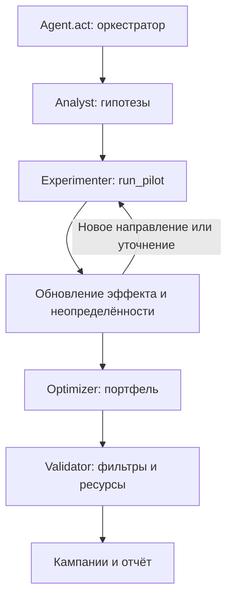

# Архитектура реализованного MVP

Версия от 23 сентября 2026 года. Это автономное Python-приложение с локальным frontend и общей памятью каждого запуска; роли разделены по модулям.

## Локальное приложение

`app.py` запускает HTTP-сервер стандартной библиотеки на `127.0.0.1:8765`. `web/` содержит адаптивный интерфейс без внешних зависимостей. JSON API в `webapp/server.py` управляет последовательной очередью задач и сохраняет историю в исключённом из Git каталоге `.local/runs/`.

Каждая задача запускает `webapp/worker.py` отдельным процессом. Исполнитель вызывает тот же `Agent` через публичный оценщик, публикует реальные события пилотов в NDJSON и сохраняет результаты в собственный каталог. Сервер переводит события в прогресс для frontend. Отмена завершает процесс, а лимит времени сервера защищает очередь от зависшего задания. При перезапуске незавершённые задания помечаются прерванными. Повреждённые записи истории пропускаются с предупреждением, их файлы сохраняются без изменений. Ошибка записи состояния не оставляет задачу в неисполняемой очереди и не должна прекращать обработку следующих задач.

До построения отчёта, оценки и экспорта `ReportingAgent` проверяет исходный ответ: список из 1–10 словарей, только поля контракта сдачи, существующие тарифы, каналы и допустимые фильтры. Для значений используется публичный `validate_strategy` из пакета участника. Это предотвращает расхождение, при котором оценщик молча исключил бы кампанию, а CSV содержал её исходную версию. После оценки проверяется равенство `n_campaigns = n_pilots + len(финальный план)`: частичная оценка не становится успешной сдачей. Ошибка сохраняется в адаптере даже при перехвате исключения штатным оценщиком; это относится также к ошибке обработчика событий прогресса. Задание завершается с ошибкой без успешного экспорта. Эти проверки относятся к локальному исполнителю и не дают агенту доступа к внутренней модели среды.

Доступны одиночный эксперимент, серия по последовательным seed и запуск тестов. В HTML/JSON отдельно показаны прогнозы агента и фактическая оценка локальной mock-среды. Экспорт `campaign_plan.csv` относится к выбранному эксперименту; официальный `submission.csv` формируется только из seed 42 при настройках агента по умолчанию. Корневые артефакты сдачи не изменяются.

API принимает только известные настройки в заданных диапазонах. Команды оболочки и произвольные пути пользователь не передаёт. Сервер проверяет локальные Host/Origin, требует JSON для действий, выдаёт только разрешённые файлы результатов и не открывается на сетевых интерфейсах. Публичное размещение и многопользовательская авторизация не входят в локальную версию.

## Реализованные компоненты

| Модуль | Ответственность |
| --- | --- |
| `agent.py` | Оркестратор, новое состояние каждого act, лимит времени, `last_report` |
| `campaign_agents/models.py` | Состояние гипотез, нормальная модель среднего, публичные фильтры |
| `campaign_agents/analyst.py` | Сегменты по текущему тарифу и ARPU, разделение крупных групп, до четырёх направлений на ячейку |
| `campaign_agents/experimenter.py` | Новые ячейки и направления, повторные пилоты, прямая проверка альтернативных каналов |
| `campaign_agents/optimizer.py` | Непересекающиеся финальные аудитории и эвристический поиск портфеля |
| `campaign_agents/validator.py` | Независимая проверка фильтров, тарифов, каналов и остатков ресурсов |

История `data/change_tariff.csv` относится к другой выборке. Медианы ограниченных относительных изменений ARPU используются только для слабого начального ранжирования, а не как доказанный причинный эффект кампании. Если история недоступна, применяется слабая гипотеза по ценам тарифов.

Пилоты обновляют нормальное распределение среднего с опубликованным шумом `0.804 / sqrt(n)`. Первичный размер — до 100 клиентов, повторный — до 150 или 200 в зависимости от неопределённости. Запросы остаются в пределах 10–200. Резервируются деньги и контакты для финального плана. При наличии подходящей гипотезы, времени и доступных пилотов резерв допускает первый пилот на 10 контактов, если остаётся хотя бы один финальный контакт и хватает бюджета на обе части. Для этого обычная доля разведочного бюджета может быть превышена до стоимости минимального пилота, но общий бюджет не превышается. Размер целой однородной группы больше не блокирует разведку: финальная кампания может ограничиваться остатком охвата. Альтернативные каналы проверяются напрямую: автоматического линейного переноса эффекта нет, поскольку конверсия может насыщаться.

Оптимизатор использует среднее минус одну стандартную ошибку как запас на шум, сравнивает портфели с четырьмя штрафами за расход денег и выбирает лучший по консервативной оценке. Поиск ограниченный, без доказательства глобального оптимума. Для узких подгрупп эффект переносится с пилота родительской группы с явной оговоркой в отчёте.

## Лимиты и пересечения

Финал: 1–10 кампаний. До 5000 контактов на кампанию, до 15000 контактов и 100000 у.е. суммарно, включая пилоты. До 20 пилотов по 10–200 человек. Рабочий бюджет времени агента по умолчанию — 240 секунд.

Остановка по времени кооперативная: оптимизатор проверяет дедлайн при построении вариантов, учёте пилотов, переборе кандидатов, выборе портфеля и резервном поиске. После истечения времени не запускается полный дополнительный перебор: возвращается уже найденный допустимый план либо ограниченный резервный вариант. Отдельная операция pandas и синхронный `run_pilot` не прерываются посередине. Финальная валидация также требует времени. Поэтому настройка не равна жёсткому ограничению длительности всего HTTP-задания; локальный сервер отдельно контролирует процесс worker.

Клиенты выбираются публичными фильтрами. В финальном экспорте нет `n_customers` или произвольных `explicit_ids`. Моделируется порядок оценщика: сортировка по `ID_NUMBER`, ограничение 5000, остаток контактов, затем доступный по бюджету охват. Сегмент может быть больше эффективного охвата; различие отражено в `eligible_customers`, `expected_contacts` и объяснении.

Финальные контакты не пересекаются. ID участников пилотов публичный API не возвращает, поэтому их вклад оценивается приближённо по вероятности случайного отбора. Абонент даёт эффект по лучшей кампании, а все контакты расходуют ресурсы. `expected_net_gain` — прогноз дополнительной выгоды финального плана после пилотов; истинный итог известен только оценщику.

## Ошибки и резервный сценарий

Ошибки пилота, отсутствующие поля, NaN и бесконечности не принимаются за валидные наблюдения. После ошибки используются реальные публичные остатки ресурсов: потраченные контакты не возвращаются в баланс.

Если прибыльный план не подтверждён, выбирается минимальная доступная экспозиция через самый дешёвый канал с предупреждением. При истечении времени резервный поиск ограничен и не гарантирует минимальный охват. При наличии бесплатного push такой резервный вариант бесплатен, но положительный эффект не гарантирован. При пустой аудитории, исчерпанном охвате или отсутствии допустимого перехода требование 1–10 кампаний невыполнимо: агент возвращает пустой список с диагностикой. Проверка worker не позволяет оформить такой список как успешный файл сдачи.

Готовность данных определяется не существованием CSV, а их целостностью. Сервер проверяет SHA-256 исходного ZIP и сравнивает с ним все семь CSV побайтово. Изменённые, пустые, отсутствующие или недоступные файлы сопровождаются диагностикой; повреждённый набор не объявляется готовым. Восстановление не перезаписывает пользовательские изменения. Проверка обзора — операция чтения, она не исправляет файлы неявно.

Агент не импортирует mock-среду или оценщик, не читает секреты и не обращается к внутренним объектам среды. Публичная фабрика вызывается только инструментами проверки и демонстрации. LLM и ключи не требуются.

## Проверка и воспроизводимость

Набор содержит 45 тестов: 16 тестов ядра, 24 теста сервера и данных, 5 тестов контракта worker. Проверяются влияние наблюдений на решения, ресурсы, повторный `act`, перестановка строк, отрицательные пилоты, ошибки наблюдений, размеры аудитории, первый доступный пилот при ограниченных ресурсах и остановка поиска по дедлайну. Серверные проверки охватывают API, целостность всех CSV, границы доступа к файлам, отмену, повреждённую историю и ошибки записи состояния. Проверки worker отклоняют неправильный сырой план, потерю кампании при оценке и сбой событий прогресса до успешного экспорта, в том числе когда штатный оценщик перехватывает исключение. `scripts/validate_web.py` выполняет настоящие HTTP-запуски и проверяет выгрузки, включая воспроизводимость официального CSV.

`scripts/validate.py` проверяет неизменность исходного оценщика, штатные прогоны, лимиты и повторную генерацию submission. Проверка повторена 23 сентября 2026 года: метрики seed 42 и серии 0–9 сохранились, файл сдачи воспроизводится. Финальная HTTP-проверка `scripts/validate_web.py` также пройдена: одиночный запуск, серия, экспорты и все 45 тестов, без ошибок, сбоев и пропусков. Метрики и результаты сохранены в `artifacts/validation.json` и `artifacts/web_validation.json`; подробности — в [requirements-audit.md](requirements-audit.md). Локальные результаты не предсказывают результат на скрытых эффектах.

Проверки синтаксиса Python (`compileall`) и JavaScript (`node --check`) пройдены. Линтер и отдельная проверка типов не настроены и не установлены, поэтому не выполнялись. Сборки frontend нет: браузер получает исходные HTML, CSS и JavaScript.

В `vendor/beeline_case_participants.zip` сохранён полный исходный пакет. `setup_case.py` проверяет SHA-256 и восстанавливает CSV без сети. Инструкции запуска — в README.

## Источники

- [D1 — Beeline Tariff Marketing Campaigns Case, Google Docs](https://docs.google.com/document/d/1bt_tgnIXnsnGMMjeaqbOY165MXmYQOTllRCDwcKySKI/edit?tab=t.0): ТЗ и отдельная рубрика на 100 баллов; [полный снимок текста](sources/google-doc-2026-09-23.txt).
- [D2 — beeline_case_participants (1).zip](https://drive.google.com/file/d/1cQUKtE_cm9TVXgzpcFwQYYUpmuFaJHHT/view): GUIDE, исходные данные, среда, оценщик, генератор сдачи и шаблон агента.
- [D3 — HackAlem AI: Beeline Tariff Marketing Campaigns Case.docx](https://drive.google.com/file/d/18zfkukVXGxjjeTaRxpCcTRxskdsNbAT-/view): фактически четырёхстраничный PDF, побайтно совпадающий с `PARTICIPANT_GUIDE.pdf` в D2. D2 и D3 не содержат рубрику D1.

Шаблон D2 указывает 5 минут без интернета; GUIDE, D1 и D3 — 10 минут с разрешённым LLM. Приоритет документов не назначается. Реализован автономный вариант с бюджетом агента 240 секунд, совместимый с обоими описаниями; технические границы проверки времени указаны выше. В описании истории переходов указано 14 824 смены, в CSV содержится 14 823 записи плюс заголовок; используется фактический файл без искусственного дополнения. Полная матрица соответствия всем трём источникам — в [аудите требований](requirements-audit.md). Все данные синтетические и не описывают реальный бизнес Beeline.
