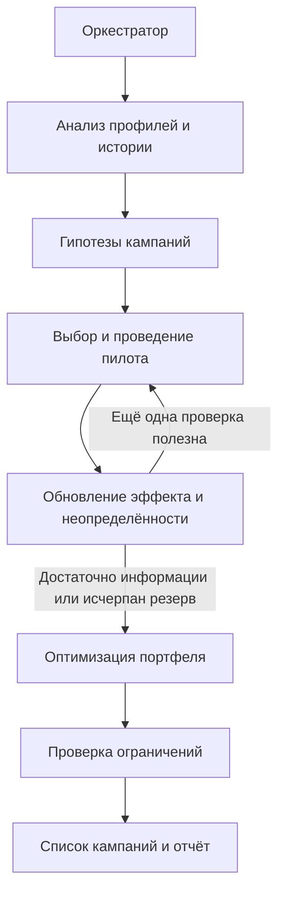

# Архитектура агентской системы

Статус: проектирование. Этот документ описывает будущую реализацию; перечисленные программные модули пока не созданы.

## Пользователь и результат

Аналитик маркетинга запускает систему на текущей аудитории. Система предлагает, кому сменить тариф, какой тариф предложить и какой канал использовать. Результат — от 1 до 10 кампаний с объяснением выбора, оценкой ожидаемого эффекта и его надёжности.

Цель: максимизировать прирост выручки относительно отсутствия кампаний за вычетом затрат на коммуникации. Эффект выражается долей ARPU и переводится в сумму через `predicted_arpu` каждого абонента. Для одного абонента учитывается лучшая кампания, а расходы на все контакты суммируются. Пилоты тоже входят в итоговый результат.

## Компоненты

| Компонент | Ответственность | Результат |
| --- | --- | --- |
| Оркестратор | Управляет циклом, временем, общим состоянием и резервом ресурсов | Очередное действие или финальный план |
| Агент-аналитик | Изучает профили и историю, строит сегменты, предлагает переходы и каналы | Проверяемые гипотезы в формате публичного API |
| Агент-экспериментатор | Выбирает пилоты, их размер и повторные проверки; обновляет оценки | Оценка эффекта, неопределённости и полезности дальнейшей проверки |
| Агент-оптимизатор | Подбирает портфель кампаний по ожидаемому чистому эффекту с учётом риска и пересечений | План в пределах оставшихся лимитов |
| Агент-контролёр | Проверяет допустимость тарифов, каналов, фильтров, охвата и расходов | Валидный список кампаний и объяснение решений |

Это логические роли внутри одного Python-приложения. Отдельные серверы или отдельный вызов LLM на каждую роль не требуются. Общее состояние содержит гипотезы, статистику пилотов, остатки ресурсов и журнал решений.



## Принятие решений

1. Проверить данные и сформировать ограниченный набор гипотез: допустимые фильтры сегмента, целевой тариф и канал.
2. Использовать историю переходов как начальную подсказку. История относится к другой выборке, поэтому историческое изменение ARPU не считать доказанным эффектом на текущую аудиторию.
3. Выполнить обязательные пилоты через `env.run_pilot()`. После каждого результата пересмотреть оценки и выбор следующего действия.
4. Увеличивать объём проверки для перспективных или пограничных гипотез, если дополнительная информация может изменить план. Размеры пилотов выбирать в пределах 10–200 клиентов, а не расходовать все 20 попыток автоматически.
5. Учитывать шум: один отрицательный маленький пилот не доказывает убыточность сегмента. Конкретную статистическую модель выбрать после проверки доступных полей ответа публичного API; не обещать точные доверительные интервалы без необходимых данных.
6. Сравнивать каналы по ожидаемому чистому эффекту. Бесплатный push расходует контакты и может дать отрицательный результат. Не применять коэффициент эффективности канала повторно, если он уже включён в наблюдение пилота.
7. Выбрать портфель по предельной добавленной ценности. Учитывать пересечения аудиторий, затраты пилотов и резерв контактов. Для MVP — последовательный выбор с локальными заменами; улучшения подтверждать сравнением прогонов.
8. Проверить итоговый план и вернуть его из `Agent.act(env)`. Если оценки не дают положительного плана, явно фиксировать неопределённость и выбирать минимально рискованный допустимый вариант; не заявлять гарантированную прибыль.

## Контракт и ограничения

Точка входа: `agent.py`, класс `Agent`, метод `act(self, env) -> list[dict]`.

Используются только публичные данные и методы среды: `customer_profile`, `tariffs`, `channels`, остатки ресурсов, `pilot_history`, `run_pilot()`. Кампании выражаются поддерживаемыми фильтрами API. Произвольный список top-N клиентов не считается доступным инструментом без такого контракта.

| Ограничение | Значение |
| --- | --- |
| Итоговые кампании | От 1 до 10 |
| Абоненты на кампанию | Не более 5 000 |
| Все контакты, включая пилоты | Не более 15 000 |
| Общий бюджет, включая пилоты | Не более 100 000 у.е. |
| Пилоты | Не более 20, по 10–200 абонентов |
| Время по актуальному ТЗ | Не более 10 минут, включая LLM |

Перед каждым пилотом проверяются остатки ресурсов. Планировщик учитывает фактическую аудиторию фильтров и публичные правила отсечения, а не рассчитывает на автоматическое исправление превышений оценщиком.

В `agent_template.py` указаны более строгие условия: без интернета и до 5 минут. В актуальном ТЗ и `PARTICIPANT_GUIDE.md` разрешён LLM и указаны 10 минут. Базовое ядро проектируется автономным с целевым временем до 5 минут, чтобы соответствовать обоим вариантам. Необязательный LLM-модуль можно подключить для выбора гипотез и объяснений в режиме, где разрешена сеть. Нужны таймауты, проверка ответа и запасной алгоритм. Ключ — только из `OPENAI_API_KEY`, без записи в репозиторий.

Запрещены извлечение скрытых эффектов, обход пилотов, чтение закрытых файлов организатора и доступ к внутренностям среды. Эффекты судейства отличаются от mock; константы под локальные эффекты не подбираются.

## Планируемая структура

```text
agent.py                      # совместимая точка входа
campaign_agents/
  orchestrator.py             # цикл решений и общее состояние
  analyst.py                  # сегменты и гипотезы
  experimenter.py             # адаптивные пилоты и оценки
  optimizer.py                # портфель и пересечения аудиторий
  validator.py                # проверка ограничений
  reporting.py                # журнал и объяснения
tests/                        # проверки поведения и лимитов
docs/architecture.md
requirements.txt
README.md
submission.csv                # генерируется штатным make_submission.py
```

Файлы исходного пакета, необходимые для запуска (`customer_profile.csv`, `data/`, словари, `local_eval.py`, `make_submission.py` и модули локальной среды), будут добавлены с указанием происхождения. Код оценивания сохраняется без изменений. Необязательный демонстрационный интерфейс использует результат того же ядра.

## Демонстрационный интерфейс

Четыре блока: обзор аудитории, результаты пилотов, остатки бюджета и контактов, итоговые кампании. Для кампании показываются сегмент, тариф, канал, охват, расходы, ожидаемый эффект и неопределённость. Прогноз отделяется от результата локального оценщика. Должны быть доступны объяснение выбора и выгрузка плана.

## Этапы и критерии готовности

1. **Совместимый MVP:** импортировать пакет участника, реализовать роли и обязательные пилоты; получить корректные 1–10 кампаний без превышения лимитов.
2. **Адаптивная стратегия:** обновлять решения по наблюдениям, учитывать риск, стоимость каналов и пересечения. Проверить поведение при отрицательных пилотах и недостатке ресурсов.
3. **Воспроизводимость:** выполнить `python local_eval.py`, затем `python local_eval.py --runs 10` и `python make_submission.py`. Записать реальные результаты, длительность и ограничения. Проверить, что изменение результатов пилота действительно меняет решения.
4. **Представление результата:** добавить объяснения, демонстрационный интерфейс и инструкции запуска. Проверки ядра должны работать без интерфейса и без LLM.

Успешный локальный прогон проверяет механику, но не предсказывает балл на скрытых эффектах. README должен описывать фактически реализованную систему и команды, которые действительно проверены.

## Источники

- [Актуальное ТЗ в Google Docs](https://docs.google.com/document/d/1bt_tgnIXnsnGMMjeaqbOY165MXmYQOTllRCDwcKySKI/edit?tab=t.0).
- [Пакет участника](https://drive.google.com/file/d/1cQUKtE_cm9TVXgzpcFwQYYUpmuFaJHHT/view): `PARTICIPANT_GUIDE.md`, `agent_template.py`, словари и набор данных.
- [Версия ТЗ в DOCX](https://drive.google.com/file/d/18zfkukVXGxjjeTaRxpCcTRxskdsNbAT-/view).

Материалы изучены 23 сентября 2026 года. Данные синтетические; выводы не описывают реальные показатели Beeline.
