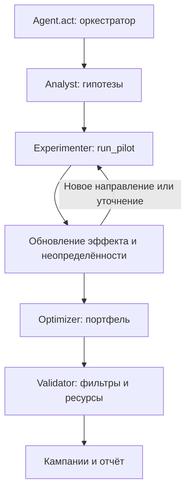

# Архитектура реализованного MVP

Версия от 23 сентября 2026 года. Это автономное Python-приложение с общей памятью текущего запуска; роли разделены по модулям.

## Реализованные компоненты

| Модуль | Ответственность |
| --- | --- |
| `agent.py` | Оркестратор, новое состояние каждого act, лимит времени, `last_report` |
| `campaign_agents/models.py` | Состояние гипотез, нормальная модель среднего, публичные фильтры |
| `campaign_agents/analyst.py` | Сегменты по текущему тарифу и ARPU, разделение крупных групп, до четырёх направлений на ячейку |
| `campaign_agents/experimenter.py` | Новые ячейки и направления, повторные пилоты, прямая проверка альтернативных каналов |
| `campaign_agents/optimizer.py` | Непересекающиеся финальные аудитории и эвристический поиск портфеля |
| `campaign_agents/validator.py` | Независимая проверка фильтров, тарифов, каналов и остатков ресурсов |

История `data/change_tariff.csv` относится к другой выборке. Медианы ограниченных относительных изменений ARPU используются только для слабого начального ранжирования, а не как доказанный причинный эффект кампании. Если история недоступна, применяется слабая гипотеза по ценам тарифов.

Пилоты обновляют нормальное распределение среднего с опубликованным шумом `0.804 / sqrt(n)`. Первичный размер — до 100 клиентов, повторный — до 150 или 200 в зависимости от неопределённости. Запросы остаются в пределах 10–200. Резервируются деньги и контакты для финального плана. Альтернативные каналы проверяются напрямую: автоматического линейного переноса эффекта нет, поскольку конверсия может насыщаться.

Оптимизатор использует среднее минус одну стандартную ошибку как запас на шум, сравнивает портфели с четырьмя штрафами за расход денег и выбирает лучший по консервативной оценке. Поиск ограниченный, без доказательства глобального оптимума. Для узких подгрупп эффект переносится с пилота родительской группы с явной оговоркой в отчёте.

## Лимиты и пересечения

Финал: 1–10 кампаний. До 5000 контактов на кампанию, до 15000 контактов и 100000 у.е. суммарно, включая пилоты. До 20 пилотов по 10–200 человек. Рабочий бюджет времени агента по умолчанию — 240 секунд.

Клиенты выбираются публичными фильтрами. В финальном экспорте нет `n_customers` или произвольных `explicit_ids`. Моделируется порядок оценщика: сортировка по `ID_NUMBER`, ограничение 5000, остаток контактов, затем доступный по бюджету охват. Сегмент может быть больше эффективного охвата; различие отражено в `eligible_customers`, `expected_contacts` и объяснении.

Финальные контакты не пересекаются. ID участников пилотов публичный API не возвращает, поэтому их вклад оценивается приближённо по вероятности случайного отбора. Абонент даёт эффект по лучшей кампании, а все контакты расходуют ресурсы. `expected_net_gain` — прогноз дополнительной выгоды финального плана после пилотов; истинный итог известен только оценщику.

## Ошибки и резервный сценарий

Ошибки пилота, отсутствующие поля, NaN и бесконечности не принимаются за валидные наблюдения. После ошибки используются реальные публичные остатки ресурсов: потраченные контакты не возвращаются в баланс.

Если прибыльный план не подтверждён, выбирается минимальная доступная экспозиция через самый дешёвый канал с предупреждением. При наличии бесплатного push такой резервный вариант бесплатен, но положительный эффект не гарантирован. При пустой аудитории, исчерпанном охвате или отсутствии допустимого перехода требование 1–10 кампаний невыполнимо: возвращается пустой список с диагностикой.

Агент не импортирует mock-среду или оценщик, не читает секреты и не обращается к внутренним объектам среды. Публичная фабрика вызывается только инструментами проверки и демонстрации. LLM и ключи не требуются.

## Проверка и воспроизводимость

11 тестов проверяют влияние наблюдений на решения, бюджет и контакты, повторный act, перестановку входных строк, отрицательные пилоты, ошибки и крайние размеры аудитории, включая однородный сегмент из 6000 клиентов.

`scripts/validate.py` проверяет неизменность исходного оценщика, штатные прогоны, лимиты и повторную генерацию submission. Метрики сохранены в `artifacts/validation.json`. Локальные результаты не предсказывают результат на скрытых эффектах.

В `vendor/beeline_case_participants.zip` сохранён полный исходный пакет. `setup_case.py` проверяет SHA-256 и восстанавливает CSV без сети. Инструкции запуска — в README.

## Следующие улучшения

1. Сравнение стратегий остановки разведки на независимых сценариях.
2. Отдельное подтверждение узких подгрупп и уточнение оценки пересечений в рамках публичного API.
3. Более широкий поиск портфеля и проверка неблагоприятных серий пилотов.
4. Необязательный LLM для гипотез с таймаутом, проверкой ответа и автономным запасным алгоритмом.
5. Интерактивное веб-приложение на основе существующего ядра и отчёта.

## Источники

- [Актуальное ТЗ](https://docs.google.com/document/d/1bt_tgnIXnsnGMMjeaqbOY165MXmYQOTllRCDwcKySKI/edit?tab=t.0).
- [Исходный пакет участника](https://drive.google.com/file/d/1cQUKtE_cm9TVXgzpcFwQYYUpmuFaJHHT/view).
- [ТЗ в DOCX](https://drive.google.com/file/d/18zfkukVXGxjjeTaRxpCcTRxskdsNbAT-/view).

Шаблон указывает 5 минут без интернета; актуальное ТЗ — 10 минут с разрешённым LLM. Реализованное ядро соответствует более строгому варианту. Все данные синтетические и не описывают реальный бизнес Beeline.
